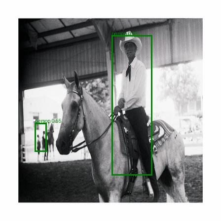

# YOLOv1
## YOLOv1 architectury PyTorch implement
Реализация архитектуры YOLOv1 для задачи детекции одного класса (person) 
**Вид архитектуры:**

Предсказание модели (на выходе): размерность 5 x B (Bounding Boxes) . Содержит координату центра Bounding box X, координату центра Y, w,h (ширина , высота) , conf ( уверенность в предсказании) а так же набор вероятностей для каждей ячейки grid cell

**Функция потерь** 

## Примеры предсказания созданой и обученой модели:  
**неплохие примеры** 

  

 
 
  

  
 
 
  

**Плохие примеры** 
  
 
 
 
  

